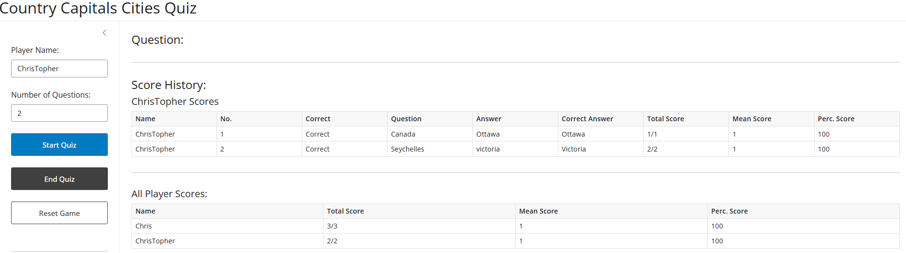
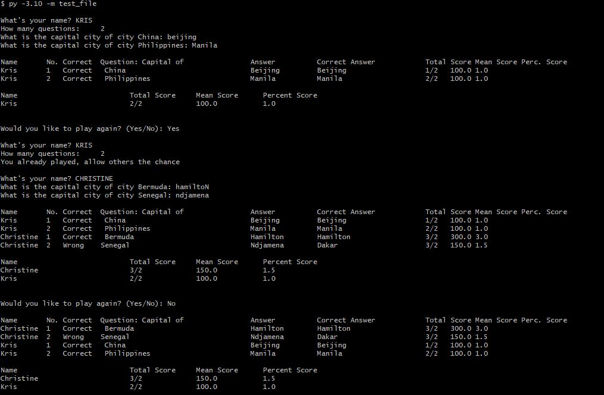

# shiny_apps

## [Python Capital Cities Quiz Shiny](Country%20Capitals%20Py%20Shiny)

Porting previous project of a Python Class, I used to create a Country Capital City Quiz (test_file.py)

- Link: https://connect.posit.cloud/akhapwoyaco/content/01944d5f-63a3-a2b6-62de-3f15c88ab38d

 
