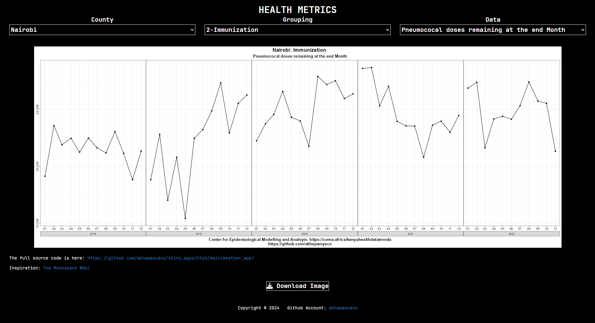

# shiny_apps

A list of R shiny Apps

## [Kenya Administrative Wards Historical and Forecast Weather Visuals](./weather_app)

Link: [Shiny App](https://019387c9-7f31-2de1-6cc8-bcd45454524b.share.connect.posit.cloud)

Shiny App feature

-   Left to Right Swap Button

Weather Data

-   14 day Rainfall, Temperature (min, max) forecast
-   Historical Monthly Rainfall
-   Historical Yearly Rainfall

## [World Bank Data Visuals](./world_bank)

-   Getting Data

## [Health Metrics](./health_metrics)

-   Link to Shiny App [health metrics](https://0193e420-2ae7-8d0c-7fff-e0b3d211b026.share.connect.posit.cloud/)
-   Data Health Metrics from [CEMA](https://cema.africa/kenyahealthdatatrends)
-   Inspired by [The Monospace Web](https://owickstrom.github.io/the-monospace-web/#introduction) 

## World Bank

-   [Global Ease of Doing Business](world_bank/Global_Ease_Of_Doing_Business)
-   [Access to electricity (% of population)](./world_bank/Access_to_Electricity)
    1.  <https://data.worldbank.org/indicator/EG.ELC.ACCS.ZS> 

## IMF

-   [DEFAULT_INTEGRATION_IMF](IMF/default)

# TODO

+ Center the inputs within divs
