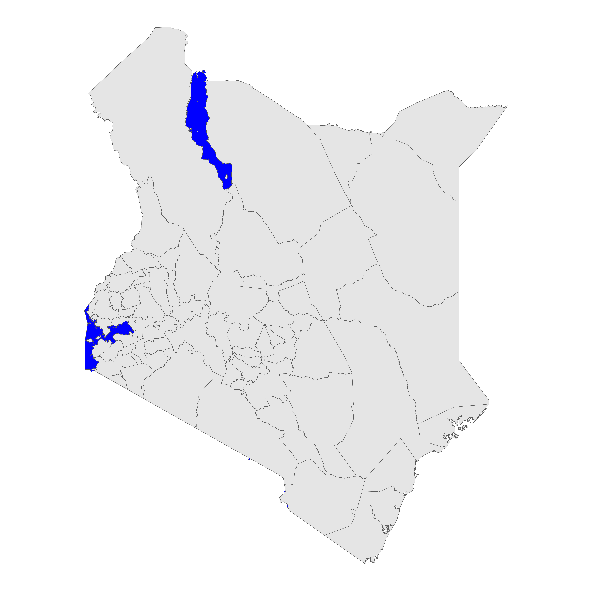
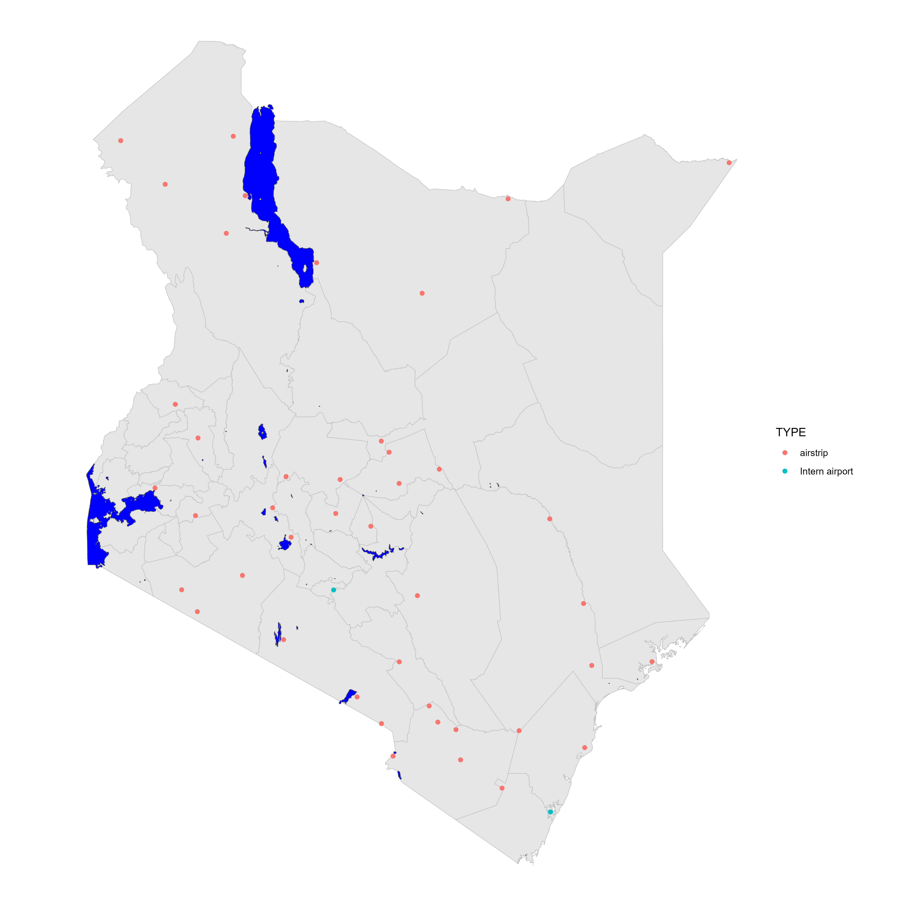
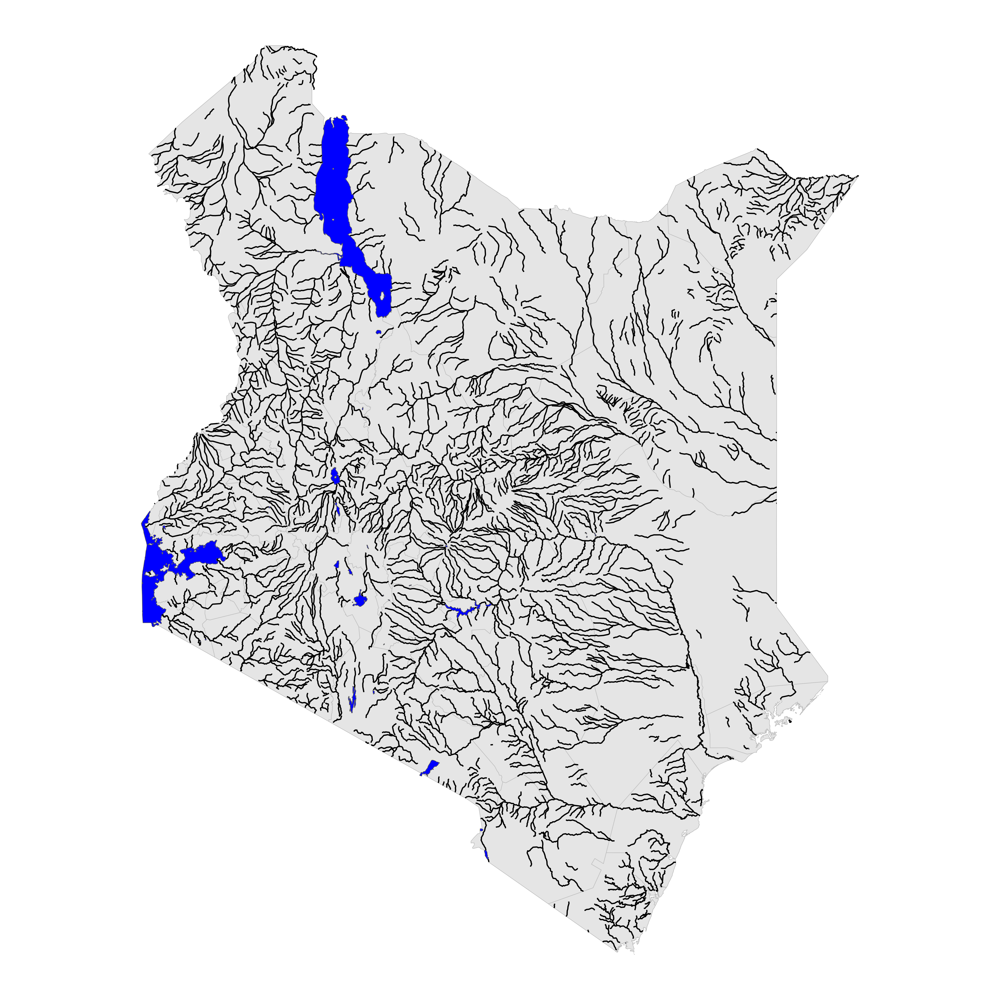
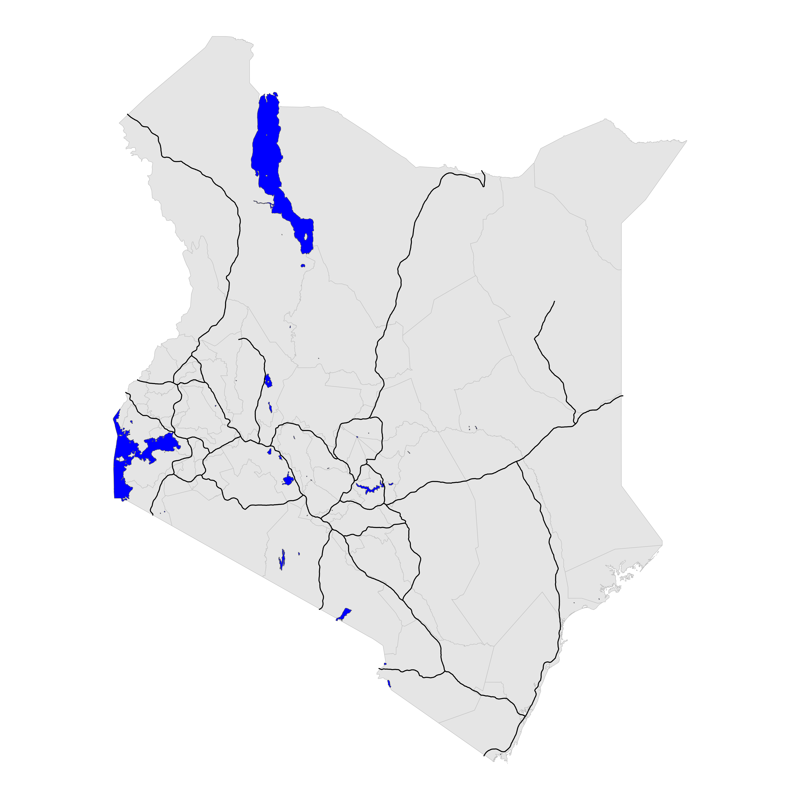

# [World Resource Institute](World_Resource_Institute)

## Data

-   Data Source: https://www.wri.org/data/kenya-gis-data

## Data Description

### Population & poverty

| Data | Description |
|:----------------------------------:|:----------------------------------:|
| ke_gini_constituency | Average inequality of per capita expenditures in Kenya (also known as the GINI Index) by Constituency in 1999. |
| ke_popd89lmb.zip | Population density, or the number of people per square kilometer, of Kenya in 1989. |
| ke_popd99lmb.zip | Population density, or the number of people per square kilometer, in Kenya in 1999. |
| ke_poverty1999-cbs_location.zip | Poverty rate, poverty gap, poverty density and the percentage of poor housing at Location level in Kenya in 1999. |
| ke_poverty_eastern-constit.zip | Poverty rate, poverty gap, poverty density and amount of Kenyan Shillings (per month per square kilometer) to close the poverty gap for Constituencies in eastern Kenya in 1999. |
| ke_poverty_theoretical-investment.zip | Minimum amount of Kenyan Shillings needed per square kilometer per month to close the poverty gap at Location level in Kenya in 1999. |

### Agriculture

| Data | Description |
|:----------------------------------:|:----------------------------------:|
| ke_agriculture | Areas of cropland in Kenya. |
| ke_crops_diversity | Average number of crops grown in croplands of central and western Kenya in 1997. |
| ke_crops_foodshare | Food crops as a percentage of all cropland in central and western Kenya in 1997. |
| ke_crops_intensity | Percent of land under cultivation in Kenya. |
| ke_crops_irrig | Large-scale irrigation in Kenya. |
| ke_crops_size | Size of agricultural fields in Kenya. |
| ke_livestock_1990 | Livestock density in Kenya's rangelands from 1994 to 1996. |
| ke_milk-production | Milk production per square kilometer in central and western Kenya in 1997. |
| ke_milk-surplus-deficit | Milk surplus and deficit in central and western Kenya in 1997. |
| ke_pineapple_plantations | Pineapple plantations in Kenya. |
| ke_tree-plantations vTree plantations in Kenya. |  |
| ke_woodlots-in-cropland | Percent woodlots in sampled cropland in central and western Kenya in 1997. |

### Land cover & land form

| Data | Description |
|:----------------------------------:|:----------------------------------:|
| ke_bareareas | Bare areas (areas naturally devoid of vegetation) in Kenya. |
| ke_coral_reefs | Coral reefs on the eastern coast of Kenya. |
| ke_floodplains | Floodplains and valley bottoms in Kenya. |
| ke_forests Forest | types in Kenya. |
| ke_mangroves | Mangroves on the eastern coast of Kenya as polygons. |
| ke_mangroves_undp-line | Mangroves on the eastern coast of Kenya as lines. |
| ke_modis | Percent treecover in Kenya. |
| ke_rangeland | Areas of savanna and grassland in Kenya. |
| ke_sand_beaches | Sand beaches in Kenya. |
| ke_urban | Urban areas in Kenya. |
| ke_wetlands | Wetlands areas in Kenya. |

### Base data

|            Data            |                 Description                  |
|:----------------------------------:|:----------------------------------:|
| ke_district_boundaries.zip | District administrative boundaries in Kenya. |
|    ke_major-rivers.zip     | Permanent and non-permanent rivers in Kenya. |
|    ke_key-airfields.zip    |          Major airfields in Kenya.           |
|     ke_major-roads.zip     |            Major roads in Kenya.             |
|     ke_major-towns.zip     |            Major towns in Kenya.             |
|   ke_protected-areas.zip   |          Protected areas in Kenya.           |
|     ke_waterbodies.zip     |            Water bodies in Kenya.            |

 
 
 
 
 
 

### Elevation

|       Data       |                       Description                        |
|:----------------------------------:|:----------------------------------:|
|   dem_250m.zip   | Kenya's digital elevation model at 250-meter resolution. |
| hillshd_90m.zip  |  Kenya's shaded relief surface at 90-meter resolution.   |
| hillshd_250m.zip |  Kenya's shaded relief surface at 250-meter resolution.  |
|   ke_srtm.zip    | Kenya's digital elevation model at 90-meter resolution.  |

### Rainfall

|     Data      |                  Description                  |
|:-------------:|:---------------------------------------------:|
| ke_totann.zip |       Average annual rainfall in Kenya.       |
|  prec_2.zip   | World's average monthly rainfall in February. |
|  prec_4.zip   |  World's average monthly rainfall in April.   |
|  prec_7.zip   |   World's average monthly rainfall in July.   |
|  prec_11.zip  | World's average monthly rainfall in November. |

### Biodiversity & wildlife

| Data | Description |
|:----------------------------------:|:----------------------------------:|
| ke_dugong-dolphin-sites | Dugong sites and dolphin schools on the eastern coast of Kenya. |
| ke_eba Endemic | Bird Areas (EBAs) in Kenya. |
| ke_grevys_1970s | Number of observed Grevy's zebra from 1977 to 1978 in Kenya. |
| ke_grevys_1990s | Number of observed Grevy's zebra from 1994 to 1996 in Kenya. |
| ke_grevys_range | Potential range of Grevy's zebra in Kenya. |
| ke_iba-status | Important Bird Areas (IBAs) and their status in Kenya in 2003-2004. |
| ke_mammals | Predicted mammal diversity, or the total number of mammal species, in Kenya. |
| ke_numbers_buffalo | Spatial distribution of buffalo numbers observed from low-altitude flights in Kenya from 1994 to 1996. |
| ke_numbers_elephant | Spatial distribution of elephant numbers observed from low-altitude flights in Kenya from 1994 to 1996. |
| ke_numbers_giraffe | Spatial distribution of giraffe numbers observed from low-altitude flights in Kenya from 1994 to 1996. |
| ke_numbers_wildebeest | Spatial distribution of wildebeest numbers observed from low-altitude flights in Kenya from 1994 to 1996. |
| ke_numbers_wildebeest_kitengela | Number of wildebeest observed in 1977-78 and 1994-96 in the Athi-Kapiti Plains, Kenya. |
| ke_numbers_zebra | Spatial distribution of zebra numbers observed from low-altitude flights in Kenya from 1994 to 1996. |
| ke_sable_antelope_sites | Sable antelope sites on the eastern coast of Kenya. |
| ke_turtle_breeding_site | Turtle nesting and breeding sites on the eastern coast of Kenya. |
| ke_wildlife_1970-90 | Change in wildlife density in Kenya's rangelands between 1977-78 and 1994-96. |
| ke_wildlife_1970 | Wildlife density in Kenya's rangelands from 1977 to 1978. |
| ke_wildlife_1990 | Wildlife density in Kenya 's rangelands from 1994 to 1996. |

### Tourism

| Data | Description |
|:----------------------------------:|:----------------------------------:|
| ke_hotel-beds_coast.zip | Capacity, or number of beds, for major tourist hotels on the eastern coast of Kenya. |
| ke_hotels-lodges-campsites.zip | Tourist accommodations in Kenya. |

### Water, irrigation, & hydropower

| Data | Description |
|:----------------------------------:|:----------------------------------:|
| ke_hydropower-dams | Large hydropower dams in Kenya. |
| ke_micro-hydro | Micro-hydropower sites in Kenya. |
| ke_micro-hydro_proposed | Proposed micro-hydropower sites in Kenya. |
| ke_mombasa_dams | Water supplies serving Mombasa, Kenya. |
| ke_nairobi-dams | Water supplies serving Nairobi, Kenya. |
| ke_proposed-irrigation | Large-scale irrigation schemes in Kenya. |
| ke_small-scale_irrigation | Existing small-scale irrigation and drainage points in Kenya. |
| ke_water-balance | Annual projected water balance by subdrainage area in Kenya for 2000 and 2010. |
| ke_water_basins | River basins and sub-basins (catchments and sub-catchments) in Kenya. |
| ke_water-consumption_wildlife-livestock | Average water consumption of livestock and wildlife by sub-basin in Kenya from 1994 to 1996. |

### Other data

| Data | Description |
|:----------------------------------:|:----------------------------------:|
| dist_water.zip | Distance to water points (boreholes, etc) in northern Kenya. |
| ke_biomass_totalsqkm.zip | Annual growth of biomass outside of croplands and the theoretically harvestable biomass yield outside of croplands in Kenya. |
| ke_charcoal-sources.zip | Sources of wood for charcoal in selected administrative Districts of Kenya in 2004. |
| ke_market_centers.zip | Market centers in western Kenya. |
