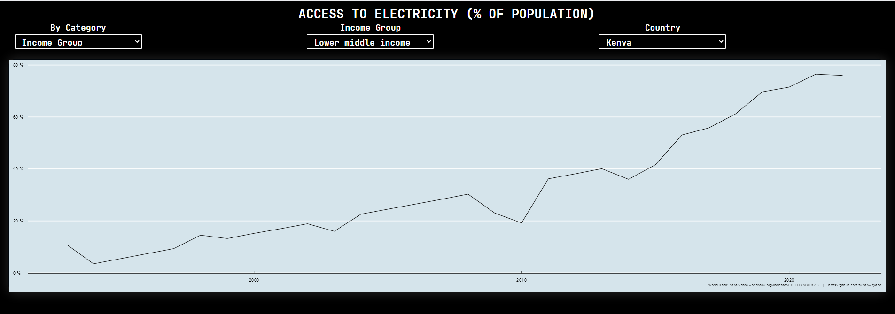

# World Bank

1.  [Global Ease of Doing Business](world_bank/Global_Ease_Of_Doing_Business)

## Data

Data Source: <https://www.kaggle.com/datasets/saurabhbadole/global-ease-of-doing-business-dataset>

### Dataset Features

| Column Name | Description |
|:----------------------------------:|:----------------------------------:|
| Country Name | The name of the country or region. |
| Country Code | A unique code representing the country. |
| Series Name | The name of the indicator being tracked (e.g., costs, time, regulatory measures). |
| Series Code | The unique code associated with each indicator. |
| 2010 [YR2010] - 2019 [YR2019] | Yearly data values for each indicator, spanning a decade. |

2.  [Access to electricity (% of population)](./world_bank/Access_to_Electricity)

## Data

Data Source: <https://data.worldbank.org/indicator/EG.ELC.ACCS.ZS>

### Dataset Features

| Column Name | Description |
|:-----------:|:-----------:|

